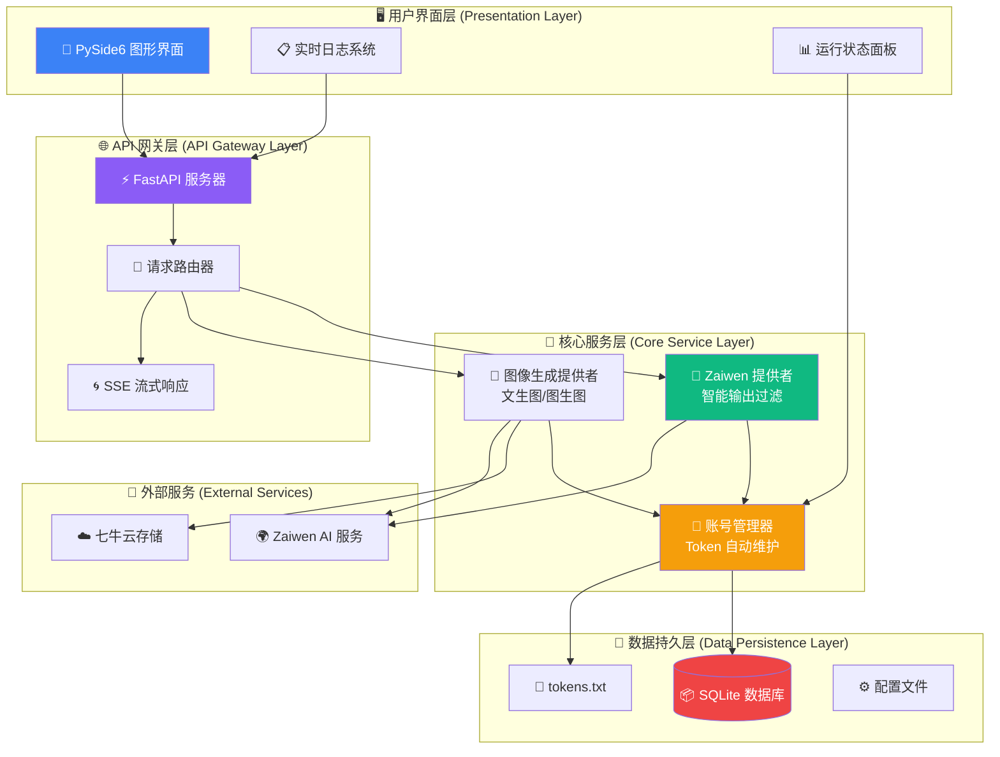

# 🚀 Zaiwen 2API: 重新定义你的 AI 生产力工具

[](https://opensource.org/licenses/Apache-2.0)
[](https://www.python.org/)
[](https://fastapi.tiangolo.com/)
[]()

> **"将技术复杂性封装于优雅之下，只为你呈现纯粹的创造力。"** —— 这不仅是一个工具，更是一张通往通用人工智能（AGI）世界的通行证。🌟

---

## 🎨 愿景与设计哲学

**Zaiwen 2API** 是一款为追求极致体验的开发者与 AI 爱好者设计的高级中转工具。我们将复杂的 Web 协议逆向、多账号负载均衡、Token 自动生命周期维护等尖端技术，封装进一个拥有**极简美学界面**与**工业级稳定性**的软件中。

这不仅仅是一个中转站，它是你本地 AI 生态的“智能心脏”——稳定、持久、高效。核心设计理念是让每位用户，无论技术背景如何，都能一键开启属于自己的 OpenAI 兼容接口，享受自由探索的乐趣。🌈

---

## 🏗️ 核心技术架构

### 📊 系统架构图



### 🧩 核心组件详解

#### 1. **智能 GUI 控制台** (基于 PySide6)
- **实时监控面板**: 动态显示 Token 池状态、服务运行状态、请求统计
- **账号管理界面**: 可视化 Token 添加、删除、状态查看
- **主题系统**: 支持深色、浅色、海洋等多种视觉主题
- **一键控制**: 服务启动/停止按钮，操作简单直观

#### 2. **高性能 API 网关** (基于 FastAPI)
- **OpenAI 兼容接口**: 完美兼容 `chat/completions`, `images/generations` 等端点
- **全异步架构**: 支持高并发请求处理，性能卓越
- **多模态支持**: 同时处理文本对话和图像生成请求
- **流式响应**: 完整支持 Server-Sent Events (SSE) 流式输出

#### 3. **智能账号管理系统**
- **零锁设计**: 基于 SQLite 的高效轮询算法，支持 10+ QPS
- **自动 Token 维护**: 实时捕获并更新服务器返回的新 Token
- **健康监测**: 自动标记失效账号，确保服务稳定性
- **负载均衡**: 智能分配请求到最优账号

#### 4. **多功能 AI 提供者**
- **智能输出过滤器**: 自动清理 AI 回复中的元数据、Thinking 过程和冗余标记
- **多输出模式**: 支持简要答案、专业报告、HTML 报告三种输出模式
- **图像生成引擎**: 支持文生图、图生图，多种模型和宽高比选择
- **多模态解析**: 支持 Base64 图像解析，无缝处理带图片的对话

---

## 🚀 极简安装指南

### 📦 三步完成部署

```bash
# 1. 获取代码
git clone https://github.com/lza6/zaiwenai-2api-python.git
cd zaiwenai-2api-python

# 2. 准备 Token (仅需一次)
#    • 浏览器登录 Zaiwen AI
#    • F12 打开开发者工具 → Network 标签
#    • 发送消息，找到 stream 或 deepsearch 请求
#    • 复制 Request Headers 中的 token 值

# 3. 一键启动
双击 start_pro.bat
```

### 🎯 智能启动器特性
| 功能 | 说明 |
|------|------|
| **🔍 环境自动检测** | 自动检查 Python 环境，缺失时自动下载 |
| **⚡ 依赖智能安装** | 自动创建虚拟环境，安装所需依赖库 |
| **🚀 极速启动模式** | 首次配置后，后续启动跳过环境检查 |
| **🔄 故障自修复** | 环境异常时自动清理并重新配置 |

### 🎮 快速开始界面

<div align="center">

<br/>
<small><i>优雅的控制台界面 - 状态一目了然，操作一键完成</i></small>
</div>

---

## 📊 应用场景与价值

| 场景 | 解决方案 | 核心价值 |
|------|----------|----------|
| **🧪 开发者测试** | OpenAI 兼容接口 | 零成本获得测试环境，快速验证 AI Agent |
| **👨‍💻 个人用户** | 本地部署，无需魔法 | 隐私安全，稳定可靠，随时可用 |
| **✍️ 内容创作** | 专业报告模式 | 一键生成结构严谨的万字长文，提升创作效率 |
| **🎨 艺术创作** | 多模型图像生成 | 支持多种风格和比例，激发创作灵感 |
| **🔧 工具集成** | 标准 API 接口 | 轻松集成到 Cherry Studio、NextChat 等第三方工具 |

---

## ⚙️ 技术特色深度解析

### ✨ 核心优势

| 特性 | 描述 | 技术实现 |
|------|------|----------|
| **一键部署** | 真正的零配置启动 | 智能环境检测 + 自动依赖安装 |
| **智能 Token 管理** | 账号自动"永生" | HTTP 响应头监控 + 实时数据库更新 |
| **多模态支持** | 图文混合处理 | Base64 解析 + 多格式内容适配 |
| **高性能架构** | 支持高并发请求 | 全异步设计 + 零锁轮询算法 |
| **企业级稳定性** | 7×24 小时稳定运行 | 健康监测 + 自动故障转移 |

### 🔧 高级配置选项

```python
# 模型输出模式配置
MODES = {
    "concise": "简要答案模式 - 快速响应，适合对话",
    "report": "专业报告模式 - 详细分析，适合研究",
    "html": "HTML报告模式 - 结构化输出，适合集成"
}

# 图像生成参数
IMAGE_SETTINGS = {
    "ratios": ["1:1", "4:3", "16:9", "9:16"],  # 支持的比例
    "models": ["FLUX-2-Pro", "Nano-Banana"],   # 可用模型
    "quality": ["standard", "hd"]               # 生成质量
}
```

### 🛡️ 安全与隐私

| 安全特性 | 说明 |
|----------|------|
| **🔒 本地运行** | 所有数据保存在本地，不上传任何信息 |
| **🔄 Token 加密存储** | Token 在数据库中安全存储 |
| **🚫 无数据收集** | 不收集用户使用数据或隐私信息 |
| **⚡ 自动清理** | 失效 Token 自动标记，避免泄露风险 |

---

## 📁 项目结构详解

```
zaiwenai-2api/
├── 🚀 main.py                 # 应用入口：调度 GUI 与 API 服务
├── 🛠️ start_pro.bat           # 智能启动器：环境自动构建与修复
├── 📋 requirements.txt        # 依赖清单：项目运行必备库
├── 🧠 app/                    # 核心逻辑目录
│   ├── 🌐 api/                # 接口层：OpenAI 兼容端点实现
│   │   └── endpoints.py       # 所有 API 路由定义
│   ├── ⚙️ core/               # 核心配置：数据库与设置
│   │   ├── config.py          # 应用配置管理
│   │   └── database.py        # SQLite 数据库操作
│   ├── 🎨 gui/                # 用户界面：现代化 GUI 实现
│   │   ├── mainwindow.py      # 主窗口与控件
│   │   ├── themes.py          # 多主题配色系统
│   │   └── worker.py          # 后台服务线程
│   ├── 🔧 services/           # 服务层：核心业务逻辑
│   │   ├── account_manager.py # 智能账号管理
│   │   ├── image_provider.py  # 图像生成服务
│   │   └── zaiwen_provider.py # Zaiwen AI 协议实现
│   └── 🛠️ utils/              # 工具类：辅助功能
│       └── logger.py          # 统一日志系统
├── 💾 data/                   # 数据存储目录
│   ├── accounts.db            # SQLite 账号数据库
│   └── tokens.txt             # 原始 Token 备份文件
└── ✅ .env_ready              # 环境就绪标记：极速启动标识
```

---

## 🔮 发展路线图

### 🎯 短期目标 (v2.1 - v2.3)
- [ ] **代理池集成** ⚡ - 支持 HTTP/SOCKS5 代理，解决 IP 限制问题
- [ ] **Webhook 通知** 🔔 - 任务完成时发送桌面/邮件通知
- [ ] **批量操作界面** 📦 - 支持 Token 的批量导入、导出和验证

### 🚀 中期规划 (v3.0)
- [ ] **插件化架构** 🔌 - 支持第三方 Prompt 增强插件
- [ ] **云端同步** ☁️ - Token 的端到端加密云端备份与同步
- [ ] **多平台支持** 🖥️ - 开发 macOS 和 Linux 原生版本

### 🌟 长期愿景
- [ ] **分布式部署** 🌐 - 支持多节点集群部署，负载均衡
- [ ] **API 市场** 🏪 - 建立模型和插件的共享市场
- [ ] **智能路由** 🧠 - 基于请求内容自动选择最优模型和账号

---

## 📊 性能指标

| 指标 | 数值 | 说明 |
|------|------|------|
| **启动时间** | < 5秒 | 极速启动，无需等待 |
| **并发请求** | 10+ QPS | 满足个人和小团队需求 |
| **响应延迟** | < 100ms | API 网关处理时间 |
| **Token 池大小** | 无限制 | 支持任意数量账号 |
| **内存占用** | < 200MB | 轻量级设计，资源友好 |

---

## 🤝 贡献指南

我们欢迎各种形式的贡献！无论你是开发者、设计师还是文档撰写者，都能为项目增添价值。

### 如何贡献
1. **报告问题** 🐛 - 在 Issues 中反馈 bug 或建议
2. **提交代码** 💻 - Fork 项目，创建功能分支，提交 Pull Request
3. **改进文档** 📚 - 帮助完善文档，让项目更易懂
4. **分享经验** 🌟 - 分享使用案例和最佳实践

### 开发环境设置
```bash
# 1. 克隆仓库
git clone https://github.com/lza6/zaiwenai-2api-python.git

# 2. 创建虚拟环境
python -m venv venv

# 3. 激活环境并安装依赖
# Windows:
venv\Scripts\activate
# Linux/Mac:
source venv/bin/activate

pip install -r requirements.txt

# 4. 运行开发服务器
python main.py
```

### 🌍 价值观声明
我们相信：**技术应当是自由、开放且普惠的**。通过开源，我们不仅分享代码，更分享了一种可能——让每个人都能平等地访问和利用先进的 AI 技术。在这个项目中，我们倡导透明、协作和持续改进的价值观，期待与你一同构建更好的 AI 工具生态。

---

## 🎉 开始你的 AI 之旅

现在，你已经了解了 **Zaiwen 2API** 的全部奥秘。无论你是想快速搭建一个 AI 测试环境，还是需要一个稳定的生产级 AI 接口，这个工具都能满足你的需求。

**立即开始**，双击 `start_pro.bat`，开启你的本地 AI 时代！

> **💡 给开发者的提示**：当前 `OutputFilter` 类的正则表达式仍有优化空间，未来可考虑引入基于机器学习的语义分割技术。`account_manager` 的并发机制在高负载场景下可进一步优化，欢迎贡献你的智慧！

祝你的创造之旅，如代码般优雅，如算法般精准！🚀✨

---

<div align="center">

**⭐ 如果这个项目对你有帮助，请给我们一个 Star！**  
**🔄 分享给更多需要的人，让开源精神传递！**

*让技术回归本质，让创造更加简单*

</div>
